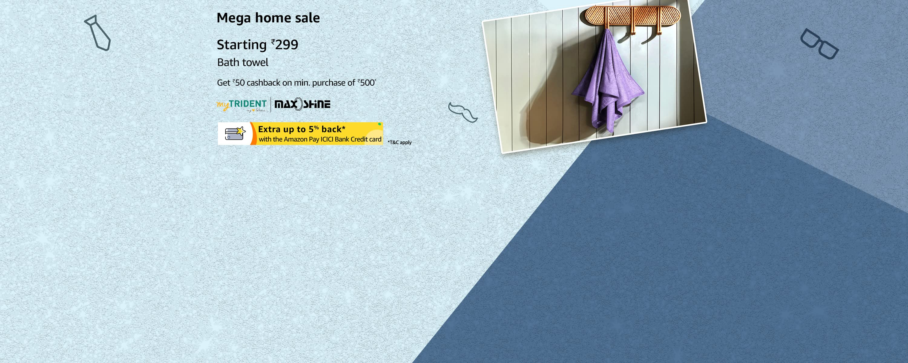
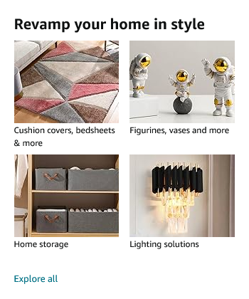
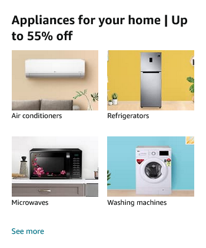

<!DOCTYPE html>
<html lang="en">
<head>
    <meta charset="UTF-8">
    <meta name="viewport" content="width=device-width, initial-scale=1.0">
    <title>Amazon Clone</title>
    <link rel="stylesheet" href="https://cdnjs.cloudflare.com/ajax/libs/font-awesome/6.5.2/css/all.min.css" integrity="sha512-SnH5WK+bZxgPHs44uWIX+LLJAJ9/2PkPKZ5QiAj6Ta86w+fsb2TkcmfRyVX3pBnMFcV7oQPJkl9QevSCWr3W6A==" crossorigin="anonymous" referrerpolicy="no-referrer" />
    <link rel="stylesheet" href="amazon.css">
</head>
<body>
    <header>
        

            

                

                    
                

            

            

                
Deliver to

                

                    <i class="fa-solid fa-location-dot"></i>
                    
Pakistan

                

            

            
            

                <select>
                    <option>All</option>
                    <option>Books</option>
                    <option>Electronics</option>
                    <option>Fashion</option>
                    <option>Home & Kitchen</option>
                </select>
                <input type="text" placeholder="Search Amazon">
                <button><i class="fa fa-search"></i></button>
                <select class="options">
                    <option>Urdu</option>
                    <option>English</option>
                    <option>Sindhi</option>
                    <option>Pashto</option>
                </select>
            

            

                

                    
Hello, Sign in

                    
Account & Lists <i class="fa fa-caret-down"></i>

                    

                        
Account

                        
Orders

                        
Logout

                    

                

                

                    
Returns

                    
& Orders

                

                

                    <i class="fa fa-shopping-cart"></i>
                    
Cart (0)

                

            

        

        

            

                

                    <i class="fa-solid fa-bars"></i>
                

                

                    
All

                

                

                    
Grocery

                

                

                    
Electronics

                

                

                    
Wearables

                

                

                    
Toys

                

                

                    
Home & Kitchen

                

                

                    
Beauty & Personal Care

                

                

                    
Sports & Outdoors

                

            

        

        

            

                
            

            

                
                
            

        

    </header>
    <main>
        <section class="deals">
            <h2>Deals of the Day</h2>
            

                

                    
                    
Product 1

                    
$29.99

                

                

                    
                    
Product 2

                    
$19.99

                

                

                    
                    
Product 3

                    
$39.99

                

                

                    
                    
Product 4

                    
$49.99

                

            

        </section>
    </main>
    
    <footer>
        

            

                <h3>Get to Know Us</h3>
                
About Us

                
Careers

                
Press Releases

            

            

                <h3>Connect with Us</h3>
                
Facebook

                
Twitter

                
Instagram

            

            

                <h3>Make Money with Us</h3>
                
Sell on Amazon

                
Affiliate Program

                
Advertise Your Products

            

            

                <h3>Let Us Help You</h3>
                
Customer Service

                
Returns & Refunds

                
Shipping Rates

            

        

        

            
&copy; 2024 Amazon Clone. All rights reserved.

        

    </footer>
    
    
</body>
</html>
/* amazon.css */
* {
    margin: 0;
    font-family: Arial, Helvetica, sans-serif;
    box-sizing: border-box;
}
body {
    background-color: #f3f3f3;
}
.navbar {
    height: 60px;
    background-color: #232F3E;
    color: white;
    display: flex;
    align-items: center;
    padding: 0 20px;
}
.navlogo {
    height: 50px;
    width: 100px;
    display: flex;
    align-items: center;
}
.logo img {
    width: 100%;
    height: auto;
}
.navaddress {
    display: flex;
    flex-direction: column;
    align-items: flex-start;
    margin-left: 20px;
}
.navaddress p {
    margin: 0;
}
.addicon {
    display: flex;
    align-items: center;
}
.addicon i {
    margin-right: 5px;
}
.searchbar {
    display: flex;
    flex-grow: 1;
    margin: 0 20px;
}
.searchbar select,
.searchbar input,
.searchbar button {
    padding: 10px;
    border: none;
}
.searchbar select {
    background-color: #e7e9ec;
}
.searchbar input {
    width: 100%;
    background-color: white;
}
.searchbar button {
    background-color: #febd69;
    cursor: pointer;
}
.options {
    margin-left: 10px;
    background-color: #e7e9ec;
}
.navitems {
    display: flex;
    align-items: center;
}
.navitem {
    margin-left: 20px;
    text-align: center;
    position: relative;
}
.navitem p {
    margin: 0;
}
.border {
    border: 1.5px solid transparent;
}
.border:hover {
    border: 1.5px solid white;
    cursor: pointer;
}
.bbar {
    height: 30px;
    background-color: #37475A;
    color: white;
    display: flex;
    align-items: center;
    padding: 0 20px;
}
.bbitem {
    display: flex;
    align-items: center;
    padding: 0 10px;
    margin-right: 10px;
}
.pp {
    font-size: small;
    margin-left: 10px;
    cursor: pointer;
}
.pp:hover {
    text-decoration: underline;
}
.mainpic {
    height: 400px;
    width: 100%;
    display: flex;
    justify-content: center;
    margin: 20px 0;
}
.mainpic img {
    height: 100%;
    width: auto;
}
.ads {
    display: flex;
    justify-content: center;
    gap: 20px;
    margin: 20px 0;
}
.ads img {
    width: 300px;
    height: auto;
}
.deals {
    background-color: white;
    padding: 20px;
    margin: 20px;
}
.deals h2 {
    margin-bottom: 20px;
}
.deals-container {
    display: flex;
    justify-content: space-between;
}
.deal-item {
    background-color: #fff;
    padding: 10px;
    text-align: center;
    box-shadow: 0 2px 5px rgba(0,0,0,0.1);
}
.deal-item img {
    width: 150px;
    height: auto;
}
.price {
    color: #B12704;
    font-weight: bold;
}
.footer-links {
    display: flex;
    justify-content: space-around;
    background-color: #232F3E;
    color: white;
    padding: 20px;
}
.footer-links div {
    display: flex;
    flex-direction: column;
}
.footer-links h3 {
    margin-bottom: 10px;
}
.footer-bottom {
    background-color: #131A22;
    color: white;
    text-align: center;
    padding: 10px 0;
}
.dropdown {
    display: none;
    position: absolute;
    top: 100%;
    right: 0;
    background-color: white;
    color: black;
    box-shadow: 0 8px 16px rgba(0,0,0,0.2);
    z-index: 1;
}
.dropdown p {
    padding: 10px;
    margin: 0;
    cursor: pointer;
}
.dropdown p:hover {
    background-color: #f1f1f1;
}

document.addEventListener('DOMContentLoaded', () => {
    const account = document.getElementById('account');
    const accountDropdown = document.getElementById('account-dropdown');
    const cartCount = document.getElementById('cart-count');

    account.addEventListener('click', () => {
        accountDropdown.style.display = accountDropdown.style.display === 'block' ? 'none' : 'block';
    });

    document.addEventListener('click', (event) => {
        if (!account.contains(event.target)) {
            accountDropdown.style.display = 'none';
        }
    });

    const searchButton = document.querySelector('.searchbar button');
    searchButton.addEventListener('click', () => {
        const searchInput = document.querySelector('.searchbar input').value;
        alert(`You searched for: ${searchInput}`);
    });

    // Example of updating cart count
    const updateCartCount = () => {
        let count = parseInt(cartCount.textContent);
        count += 1;
        cartCount.textContent = count;
    };

    // Simulate adding an item to the cart
    document.querySelector('.fa-shopping-cart').addEventListener('click', updateCartCount);
});
